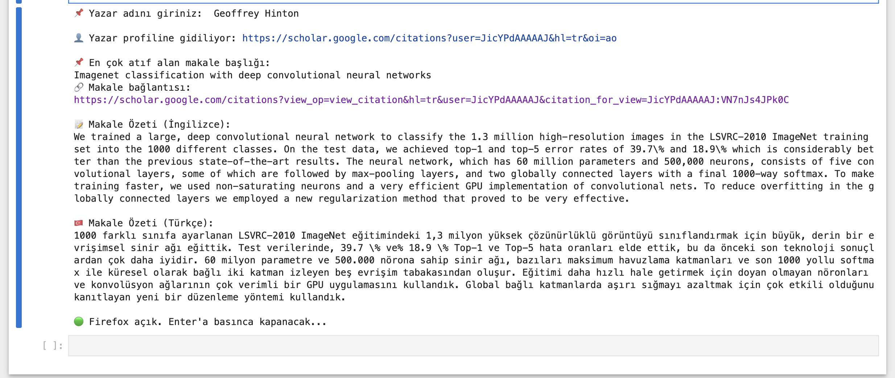

# 📚 Scholar Profile Bot

An automated Python tool that locates an author's profile on Google Scholar, identifies their most cited publication, extracts the abstract (if available), and translates it into Turkish using the `deep-translator` package.

> 🚀 Designed for researchers, students, and anyone who wants to automate citation tracking and academic translation.

---

## 🎯 Project Purpose

This bot simplifies academic literature review by automating the search and translation of key scholarly publications.

It performs the following actions:
- Finds an author's public profile on Google Scholar
- Extracts their most cited article
- Retrieves the article abstract (if available)
- Translates it into Turkish using Google Translate (via `deep-translator`)
- Displays the results in the console

---

## 🧠 Technologies Used

- Python 3.8+
- Selenium WebDriver (for browser automation)
- Deep Translator (for language translation)
- Firefox + Geckodriver
- Jupyter Notebook / Terminal compatible

---

## 📸 Screenshot

Below is a terminal screenshot showing the original and translated abstract output:



---

## 🚀 How to Use

1. Make sure Python 3.8+ is installed:
```bash
python --version
```

2. Install the required libraries:
```bash
pip install -r requirements.txt
```

3. Run the script:
```bash
python scholar_profile_bot.py
```

4. Enter the author's name when prompted:
```
📌 Enter the author's name: Geoffrey Hinton
```

5. The bot will:
   - Open Firefox
   - Locate the author profile
   - Fetch the most cited article
   - Extract and translate the abstract
   - Show both English and Turkish versions in the terminal

---

## 📂 Project Structure

```
scholar-profile-bot/
├── scholar_profile_bot.py
├── requirements.txt
├── README.md
├── images/
│   └── screenshot_main_output.png

```

---

## ⚙️ Setup Instructions

See full instructions in [SETUP_GUIDE.txt](SETUP_GUIDE.txt) for Python version, Firefox, Geckodriver, and PATH configuration.

---

## 🧑‍💻 Author

**Bahtınur Ünal**    
🌐 [GitHub](https://github.com/0xnuorr) 

---

## 📄 License

This project is licensed under the MIT License.
